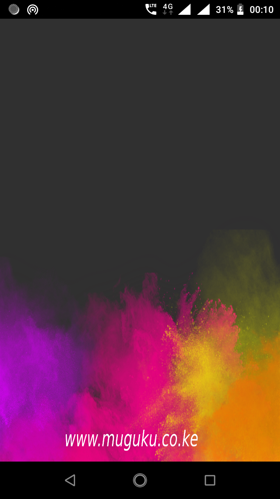
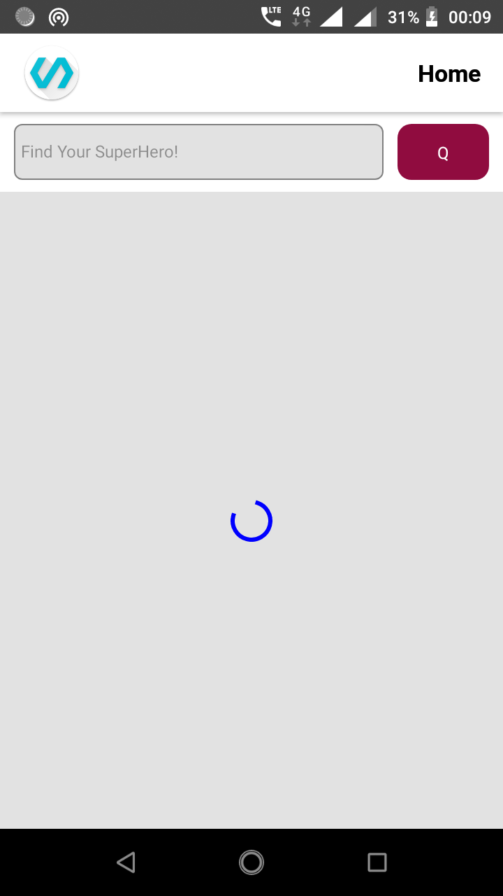
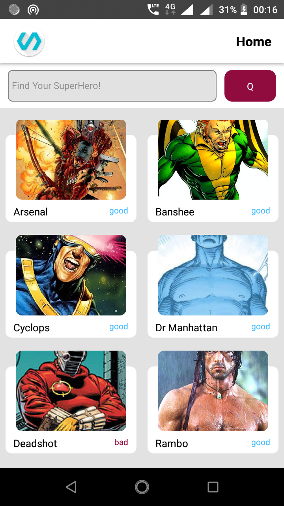
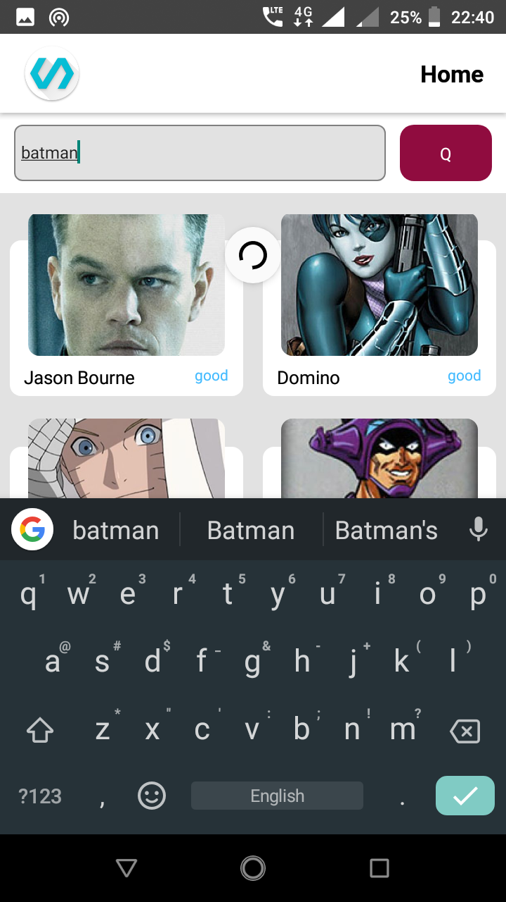
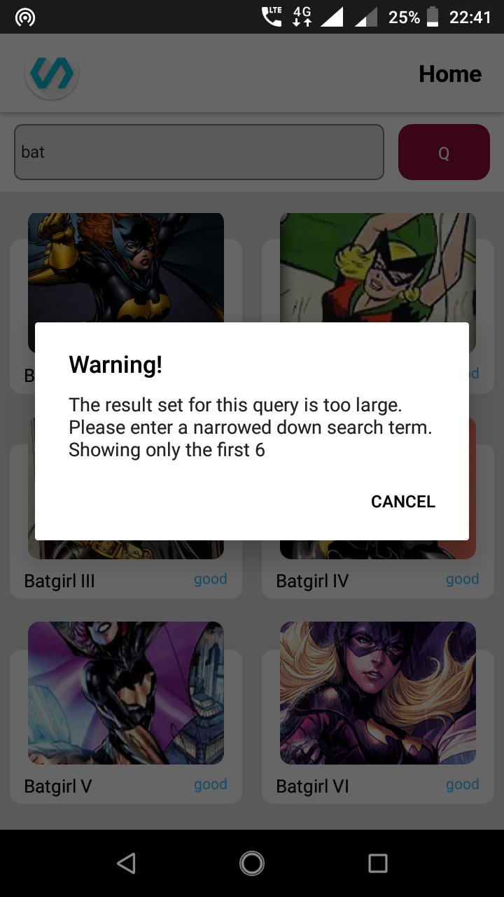
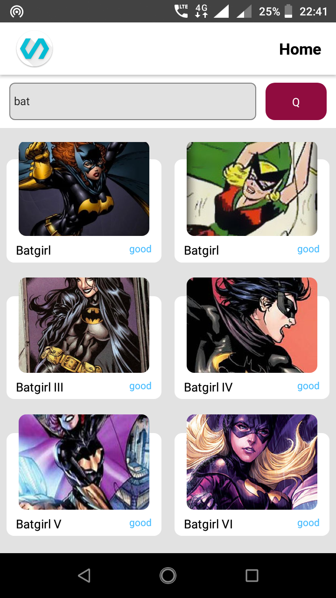
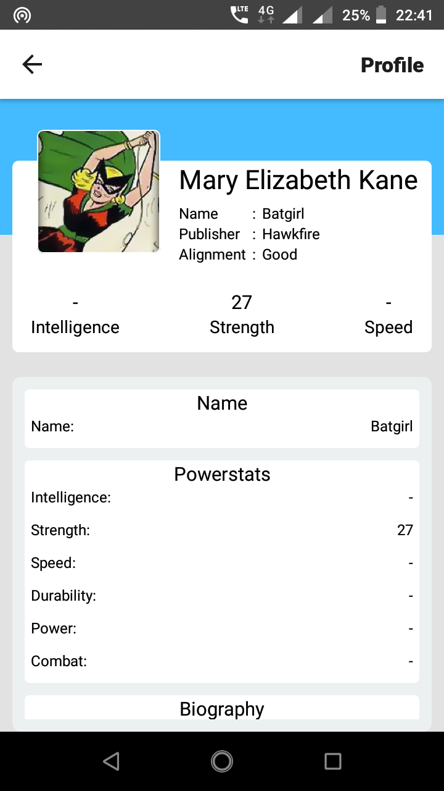

[![Contributors][contributors-shield]][contributors-url]
[![Forks][forks-shield]][forks-url]
[![Stargazers][stars-shield]][stars-url]
[![Issues][issues-shield]][issues-url]
[![MIT License][license-shield]][license-url]
[![LinkedIn][linkedin-shield]][linkedin-url]

<!-- PROJECT LOGO -->
<br />
<p align="center">
  <a href="https://github.com/machariamuguku/React-Native-SuperHero-Mobile-App/releases/tag/v1.0/">
    
  </a>

  <h3 align="center">React Native SuperHero Android/IOS Mobile App</h3>

  <p align="center">
    Source code for this android and IOS app I built with react native
    <br />
    <br />
    <a href="https://github.com/machariamuguku/React-Native-SuperHero-Mobile-App/releases/tag/v1.0">View Demo</a>
    ·
    <a href="https://github.com/machariamuguku/React-Native-SuperHero-Mobile-App/issues">Report Bug</a>
    ·
    <a href="https://github.com/machariamuguku/React-Native-SuperHero-Mobile-App/issues">Request Feature</a>

<br />
<br />
    <a href="https://www.linkedin.com/posts/machariamuguku_i-built-a-reorder-able-list-with-time-travel-activity-6746778104334704640-5tO_">Linked-in post on the motivation and what I learnt doing this Project</a>
  </p>
</p>

<!-- TABLE OF CONTENTS -->

## Table of Contents

- [About the Project](#about-the-project)
  - [Built With](#built-with)
- [Getting Started](#getting-started)
  - [Prerequisites](#prerequisites)
  - [Installation](#installation)
- [Usage](#usage)
- [Contributing](#contributing)
- [License](#license)
- [Contact](#contact)

<!-- ABOUT THE PROJECT -->

## About The Project

This is source code for this superhero mobile app i built with react native. It fetches and searches superhero data from a REST API backend and displays it tabularly and as a profile.

Check out the The web version of here [React-Native-SuperHero-Web-App](https://github.com/machariamuguku/React-Native-SuperHero-Web-App) built ontop of React Native Web.

## Screenshots

[](https://github.com/machariamuguku/React-Native-SuperHero-Mobile-App/releases/tag/v1.0/)
[](https://github.com/machariamuguku/React-Native-SuperHero-Mobile-App/releases/tag/v1.0/)
[](https://github.com/machariamuguku/React-Native-SuperHero-Mobile-App/releases/tag/v1.0/)
[](https://github.com/machariamuguku/React-Native-SuperHero-Mobile-App/releases/tag/v1.0/)
[](https://github.com/machariamuguku/React-Native-SuperHero-Mobile-App/releases/tag/v1.0/)
[](https://github.com/machariamuguku/React-Native-SuperHero-Mobile-App/releases/tag/v1.0/)
[](https://github.com/machariamuguku/React-Native-SuperHero-Mobile-App/releases/tag/v1.0/)

### Built Withproduct-screenshot-6

- [React Native](https://reactnative.dev/)
- [React](https://reactjs.org/)
- [React Query](https://github.com/tannerlinsley/react-query)
- [React Navigation](https://reactnavigation.org/)
- [This REST Superhero API](https://superheroapi.com/)

<!-- GETTING STARTED -->

## Getting Started

### Prerequisites

- `nodejs` and `yarn` package manager

- Java JDK, Android studio and android sdk 28. Xcode if planning to compile for IOS

### Installation

1. Clone the repo

```sh
git clone https://github.com/machariamuguku/React-Native-SuperHero-Mobile-App.git
```

2. Install packages

```sh
yarn
```

3. Get your SuperHero API key from and fill it in the fetch functions in /utils

<!-- USAGE EXAMPLES -->

## Usage

0. Connect your phone or fire up the android emulator

1. Run in Development

```sh
yarn android # compile and install dev bundle

npx react-native start # start app and install javascript run bundle
```

3. Build for Production

Follow instructions from [The Official React Native Documentation](https://reactnative.dev/docs/signed-apk-android)

<!-- CONTRIBUTING -->

## Contributing

Contributions are **welcome** and **appreciated**.

## License

Distributed under the MIT License. See `LICENSE` for more information.

<!-- CONTACT -->

## Contact

[@CharMgk](https://twitter.com/CharMgk)

hello@muguku.co.ke

<!-- MARKDOWN LINKS & IMAGES -->
<!-- https://www.markdownguide.org/basic-syntax/#reference-style-links -->

[contributors-shield]: https://img.shields.io/github/contributors/machariamuguku/React-Native-SuperHero-Mobile-App.svg?style=flat-square
[contributors-url]: https://github.com/machariamuguku/React-Native-SuperHero-Mobile-App/graphs/contributors
[forks-shield]: https://img.shields.io/github/forks/machariamuguku/React-Native-SuperHero-Mobile-App.svg?style=flat-square
[forks-url]: https://github.com/machariamuguku/React-Native-SuperHero-Mobile-App/network/members
[stars-shield]: https://img.shields.io/github/stars/machariamuguku/React-Native-SuperHero-Mobile-App.svg?style=flat-square
[stars-url]: https://github.com/machariamuguku/React-Native-SuperHero-Mobile-App/stargazers
[issues-shield]: https://img.shields.io/github/issues/machariamuguku/React-Native-SuperHero-Mobile-App.svg?style=flat-square
[issues-url]: https://github.com/machariamuguku/React-Native-SuperHero-Mobile-App/issues
[license-shield]: https://img.shields.io/github/license/machariamuguku/React-Native-SuperHero-Mobile-App.svg?style=flat-square
[license-url]: https://github.com/machariamuguku/React-Native-SuperHero-Mobile-App/blob/master/LICENSE
[linkedin-shield]: https://img.shields.io/badge/-LinkedIn-black.svg?style=flat-square&logo=linkedin&colorB=555
[linkedin-url]: https://www.linkedin.com/in/machariamuguku/
